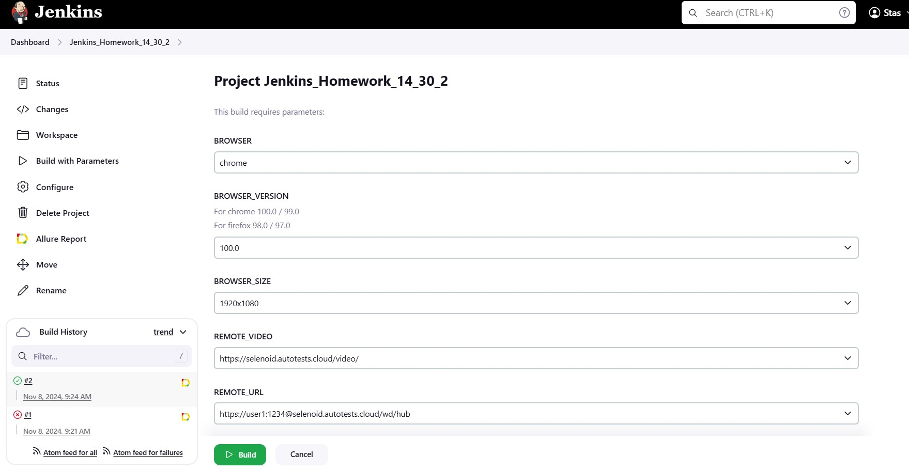
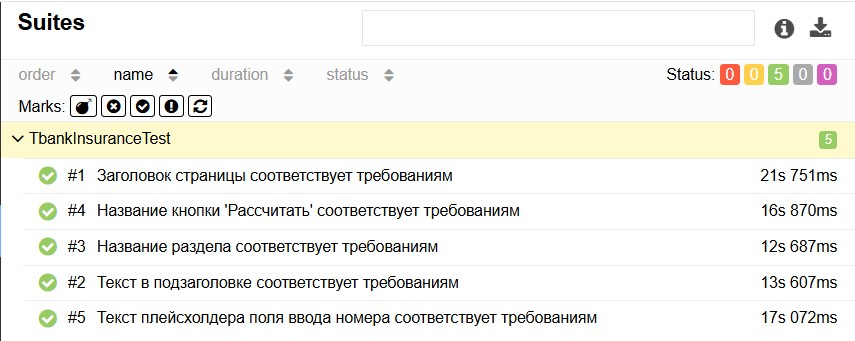
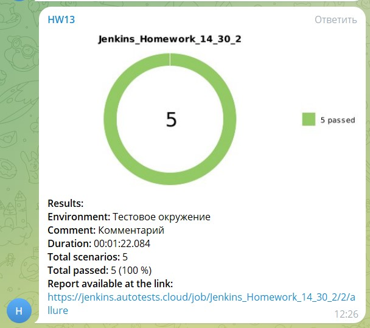
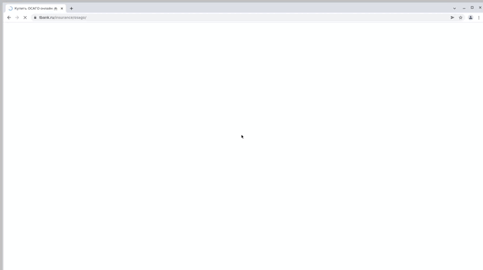

# Тесты раздела сайта [tbank.ru/insurance/osago](https://www.tbank.ru/insurance/osago) в качестве домашней работы для qa.guru

### Содержание

* <a href="#project">Проект</a>
* <a href="#vacancy">Вакансия</a>
* <a href="#jenkins">Jenkins</a>
* <a href="#allure">Allure Report</a>
* <a href="#bot">Telegram Report</a>
* <a href="#video">Видео о прохождении тестов</a>

---

<h1 align="center">Проект</h1>

Для компании Т-Страхование выполнил тестовое задание:

- Написать автотесты
- Выложить проект на GitHub
- Создать задачу в Jenkins
- Вывести отчет в Allure
- Получить уведомление о прохождении тестов в Telegram Bot

---

## <a name="Технологии:">**Технологии:**</a>

  
  
  
  
  
  
  
  
  
  

---

<h1 align="center">Вакансия</h1>

Нашел вакансию в [Telegram](https://t.me/qa_jobs/222722)

---

<h1 align="center">Jenkins</h1>

Задача в [Jenkins](https://jenkins.autotests.cloud/job/Jenkins_Homework_14_30_2/)

В качестве параметров можно выбрать:  
- Браузер
- Разрешение экрана
- Версию браузера
---

<h1 align="center">Allure Report</h1>

Отчет о прохождениии тестов в [Allure Report](https://jenkins.autotests.cloud/job/Jenkins_Homework_14_30_2/2/allure/)

---

<h1 align="center">Telegram Report</h1>

Уведомление о прохождении тестов в Telegram:

---

<h1 align="center">Видео о прохождении тестов</h1>

   

